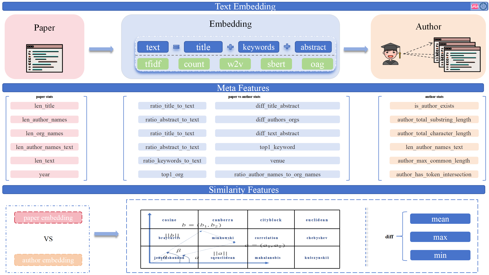
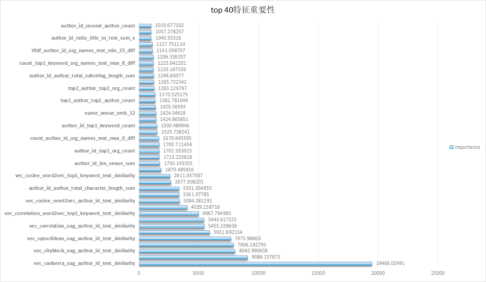
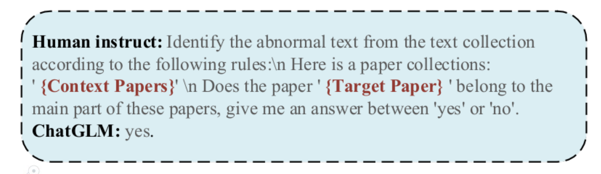

# KDD2024-WhoIsWho-Top3
KDD2024-WhoIsWho-Top3

## 1 运行环境
基础环境：
```text
Linux
Python 3.11.7
```
requirements:
```text
torch==2.3.0
torchaudio==2.3.0+cu121
torchvision==0.18.0+cu121
lightgbm==4.3.0
pandas==1.5.3
numpy==1.24.4
transformers==4.40.1
sentence-transformers==2.7.0
scikit-learn==1.2.2
gensim==4.3.0
```m


## 2 lgb codes

### 2.1 文件说明
```text
│  step0_initialize.py:初始化路径
│  step1_load_data.py：将json数据转为csv格式
│  step2_train_text_models.py：训练文本模型：tfidf/count/word2vec/glove
│  step3_extract_features_emb.py:提取文本的嵌入特征
│  step3_extract_features_stats.py：提取作者以及相关paper的统计特征
│  step3_extract_oag_features.py：提取oag嵌入表示
│  step3_merge_features.py：合并所有的特征生成完整的训练集和测试集
│  step4_train_tree.py：训练lgb1
│  step4_train_tree_imp.py：训练lgb2
│  utils.py:通用函数
│
├─cogdl：oag-bert
├─output
│  ├─step1
│  ├─step2
│  └─step3
└─result
```
运行步骤如下：

```shell
python step0_initialize.py
python step1_load_data.py
python step2_train_text_models.py
python step3_extract_features_emb.py
python step3_extract_features_stats.py
python step3_extract_oag_features.py
python step3_merge_features.py
python step4_train_tree.py lgb1
python step4_train_tree_imp.py:imp+oag特征 lgb2
```

### 2.2 建模思路
构建作者画像以及与paper的差异性特征，主要通过聚合文本来表示author，然后计算author的文本表示与每个paper的文本表示的距离特征，文本字段主要有论文的title/abstract/keywords



### 2.3 实验总结
- 特征重要性如下:

> 通过下面我们可以发下通过计算作者向量(尤其oag的表示)与每个paper的向量的距离特征很重要，另外每个作者的发表论文数量以及对应组织、合作第一作者出现统计特征也比较重要



- 通过不同的Embedding表示构建的特征维度很大，最后通过特征重要性筛选，发现取重要特征top500的效果最好
- StratifiedKFold、StratifiedGroupKFold、GroupKFold划分方式效果差不多，其中`StratifiedGroupKFold`稍微高一些
- lgb、xgb、cat融合效果没有提升，lgb效果最优
- 作者历史发表论文与待测论文的文本交叉特征比较重要


## 3 llm_codes
### 3.1 文件说明
```text
│  .gitkeep
│  finetune_chatglm3.py
│  finetune_glm4.py
│  finetune_mistral.py：mistral微调代码
│  inference_for_mistral.py：mistral预测代码
│  inference_glm.py
│  inference_glm4.py
│  infer_chatglm3.sh
│  infer_glm4.sh
│  infer_mistral.sh：mistral预测脚本
│  README.md
│  train_chatglm3.sh
│  train_glm4.sh
│  train_mistral.sh：mistral训练脚本
│
├─configs
│      ds_config_zero2.json：deepspeed配置文件
│
└─utils
        arguments.py：参数
        collator.py：数据构建
        dataset.py：数据集
        trainer.py：训练

```

以下脚本命令均在当前目录下执行

首先创建一个预测结果保存的文件夹
```
mkdir -p ./result
```

- chatglm3-6b

训练chatglm3，你需要自行修改train_chatglm3.sh中以下变量后执行**bash train_chatglm3.sh** 
```
BASE_MODEL_PATH="your model path" #你的chatglm3_6b_32k模型所在目录地址
PUB_PATH="path of pid_to_info_all.json" #pid_to_info_all.json文件路径
TRAIN_PATH="path of train_author.json" #train_author.json文件路径
```
推理chatglm3，你需要自行修改infer_chatglm3.sh中一下变量后执行**bash infer_chatglm3.sh**
```
lora_path="your lora model path" #你训练好的lora模型所在的目录地址
path_to_model="your model path" #你的chatglm3_6b_32k模型所在目录地址

path_to_pub_file="path of pid_to_info_all.json" #pid_to_info_all.json文件路径
path_to_eval_author="path of ind_test_author_filter_public.json" #ind_test_author_filter_public.json文件路径
```

- mistral-7b

训练mistral，你需要自行修改train_mistral.sh中以下变量后执行**bash train_mistral.sh** 

```
BASE_MODEL_PATH="your model path" #你的Mistral-7B-Instruct-v0.2模型所在目录地址
PUB_PATH="path of pid_to_info_all.json" #pid_to_info_all.json文件路径
TRAIN_PATH="path of train_author.json" #train_author.json文件路径
```
推理mistral，你需要自行修改infer_mistral.sh中一下变量后执行**bash infer_mistral.sh**
```
lora_path="your lora model path" #你训练好的lora模型所在的目录地址
path_to_model="your model path" #你的Mistral-7B-Instruct-v0.2模型所在目录地址

path_to_pub_file="path of pid_to_info_all.json" #pid_to_info_all.json文件路径
path_to_eval_author="path of ind_test_author_filter_public.json" #ind_test_author_filter_public.json文件路径
```

- glm4-9b

训练glm4，你需要自行修改train_glm4.sh中以下变量后执行**bash train_glm4.sh** 

```
BASE_MODEL_PATH="your model path" #你的glm-4-9b-chat模型所在目录地址
PUB_PATH="path of pid_to_info_all.json" #pid_to_info_all.json文件路径
TRAIN_PATH="path of train_author.json" #train_author.json文件路径
```
推理glm4，你需要自行修改infer_glm4.sh中一下变量后执行**bash infer_glm4.sh**
```
lora_path="your lora model path" #你训练好的lora模型所在的目录地址
path_to_model="your model path"  #你的glm-4-9b-chat模型所在目录地址

path_to_pub_file="path of pid_to_info_all.json" #pid_to_info_all.json文件路径
path_to_eval_author="path of ind_test_author_filter_public.json" #ind_test_author_filter_public.json文件路径
```

运行结束后检查你的result文件夹下是否有3个预测结果文件


### 3.2 建模思路

利用大模型判断特定的文本（即“目标论文”）是否属于一个给定的作者文本集合（即“论文集合”）。

- `Context Papers`为属于当前作者的论文集合
- `Target Paper`为待测论文



### 3.3 实验总结

通过Lora微调ChatGLM3、GLM4-Chat、Mistral-7B模型，然后得到对应结果文件进行融合
## 4 模型融合
多个预测结果的归一化和加权合并，请查看`merge.py`文件：

首先定义归一化和合并的函数， 从JSON文件中读取预测结果，然后对读取的结果进行归一化处理，最后根据给定的权重对归一化后的结果进行合并，将合并后的结果保存到新的JSON文件中。

## 5 团队介绍
- **Asir** B站大模型团队 算法工程师
- **yanqiang** 中科院计算所GoMate团队 算法工程师
